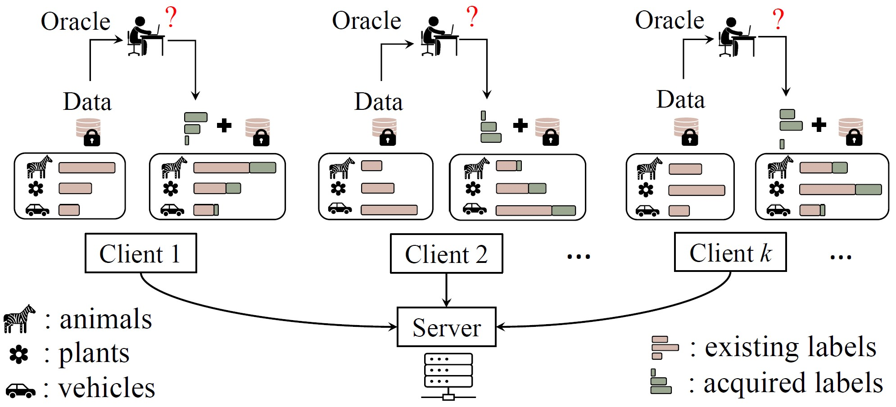
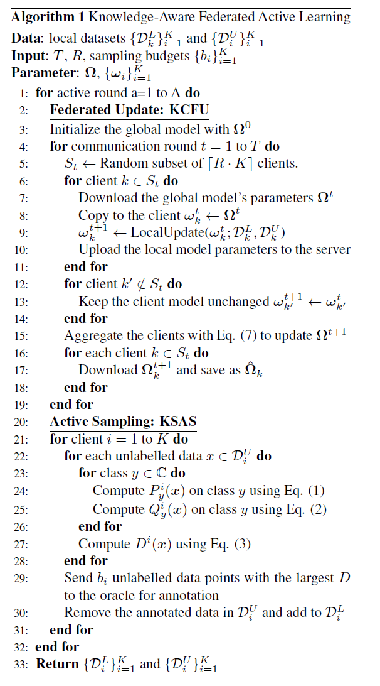

# Knowledge-Aware Federated Active Learning with Non-IID Data


This is the official implementation of the paper [Knowledge-Aware Federated Active Learning with Non-IID Data](https://arxiv.org/abs/2211.13579) (ICCV23).

## Table of contents

- [Problem](#problem)
- [Method](#method)
- [Training](#training)
- [Citation](#citing-kafal)

## Problem


In this paper,
we propose a federated active learning paradigm to
efficiently learn a global model with a limited annotation
budget while protecting data privacy in a decentralized
learning manner. The main challenge faced by federated
active learning is the mismatch between the active
sampling goal of the global model on the server and
that of the asynchronous local clients. This becomes even
more significant when data is distributed non-IID across
local clients. 


## Method
We propose a federated active learning scheme, namely Knowledge-
Aware Federated Active Learning (**KAFAL**)， that comprises
two key components, Knowledge-Specialized Active
Sampling (**KSAS**) and Knowledge-Compensatory Federated Update (**KCFU**).
### KSAS
Given the mismatch problem in federated active learning,
informative data on each client may not be that informative
to the global model due to the non-IID data distributions,
meaning that using only one of them for active
sampling is therefore not reliable. We propose
to enable each client to intensify its specialized knowledge
(common class knowledge) in the computation of discrepancy
to sample more informative data containing specialized
knowledge. We introduce the knowledge-specialized
KL-Divergence that focuses on each
client’s specialized knowledge and selects more informative
data points from its specialized classes for labelling. It amplifies
the KL-Divergence on classes that are considered
to contain the client’s specialized knowledge (frequent classes in training data).

### KCFU
The local data on each client follows its own realistic data distributions [18],
thus leaving non-uniform class distribution on each client.
Besides, our KSAS which tends to annotate data with
specialized-knowledge further introduces imbalance in labelled
data. Therefore, we introduce KCFU that includes a balanced classifier and a 
knowledge-ompensatory strategy. The former prevents the
model from becoming biased towards common classes during
training and the latter compensates for the clients’ knowledge
on the weak classes to reduce statistical heterogeneity of clients.

The whole learning process:


## Training
1. run `git clone https://github.com/anonydoe/Knowledge-Aware-Federated-Active-Learning-with-Non-IID-Data.git` to download the project
2. run `pip install -r requirements.txt` to download the required packages
3. run the code with `python3 main.py` or alternatively `python3 -u main.py > log.txt` to save the log file

## Citing KAFAL
```bibtex
@misc{cao2023knowledgeaware,
      title={Knowledge-Aware Federated Active Learning with Non-IID Data}, 
      author={Yu-Tong Cao and Ye Shi and Baosheng Yu and Jingya Wang and Dacheng Tao},
      year={2023},
      eprint={2211.13579},
      archivePrefix={arXiv},
      primaryClass={cs.LG}
}
```